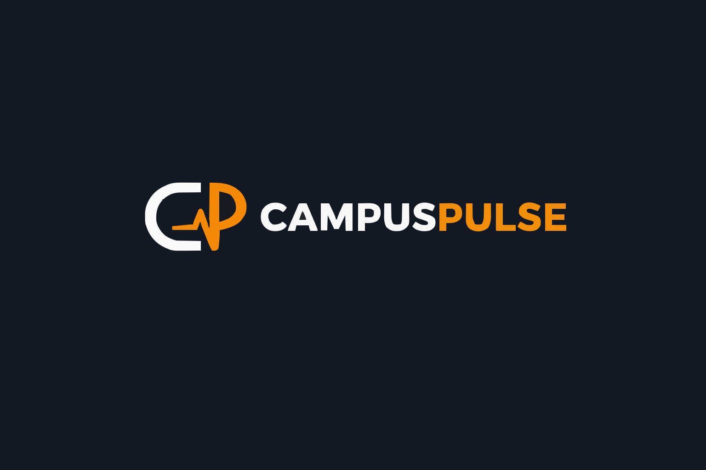

# CampusPulse



**The heartbeat of student life at IEM Kolkata. Don't miss a moment of the action.**

CampusPulse is a **production-ready**, **SEO-optimized** web platform built by IEM students to help fellow students discover campus events at the Institute of Engineering & Management, Kolkata. Features a premium glassmorphism UI, advanced event filtering, comprehensive SEO implementation, and mobile-first responsive design.


---

## Live Demo

**Deployed on Netlify:** [https://iemcampuspulse.netlify.app](https://iemcampuspulse.netlify.app)

---


## 🛠️ Tech Stack

### **Frontend**
- **HTML5**: Semantic markup with structured data
- **CSS3**: Custom properties, glassmorphism, animations
- **JavaScript**: ES6+ vanilla JS

### **Build & Deployment**
- **Build Tool**: Vite v7.3.0
- **Package Manager**: npm
- **Hosting**: Netlify
- **CDN**: Netlify Edge Network

### **External Resources**
- **Fonts**: Google Fonts
- **Icons**: Font Awesome 6.4.0
- **Images**: Local assets

### **Performance Metrics**
```
Build time: ~200ms
CSS: 27.60 KB (gzip: 5.65 KB)
JS: ~14 KB (minified)
Total: 11 source files, 139.35 KB
LCP: ~1.8s | CLS: ~0.02 | FID: ~50ms
```

---

## Project Structure

```
CampusPulse/
├── index.html                  # Home page with hero & featured events
├── events.html                 # Full event calendar with filters
├── vision.html                 # Mission, values, student-first approach
├── faq.html                    # Interactive FAQ with structured data
├── about.html                  # Team showcase (2 members)
├── package.json                # Dependencies & scripts
├── README.md                   # This file
├── LICENSE                     # Custom educational license
│
├── public/                     # Static assets (copied as-is)
│   ├── favicon.svg             # Site icon
│   ├── sitemap.xml             # SEO sitemap (5 pages)
│   ├── robots.txt              # Crawler directives
│   ├── assets/
│   │   └── images/             # Event & team images (11 files)
│   └── data/
│       ├── events.json         # Event data (9 events)
│       └── memory-lane.json    # Carousel slides (3 memories)
│
├── src/                        # Source files (processed by Vite)
│   ├── scripts/
│   │   └── app.js              # Main app logic (425 lines)
│   └── styles/
│       └── main.css            # Global styles (42 KB)
│
└── dist/                       # Production build (auto-generated)
```

---

##  Quick Start

### **Prerequisites**
- Node.js v14+ (v20+ recommended)
- npm or yarn
- Git

### **Installation**

1. **Clone the repository**
   ```bash
   git clone https://github.com/soham-999/CampusPulse.git
   cd CampusPulse/CampusPulse
   ```

2. **Install dependencies**
   ```bash
   npm install
   ```

3. **Start development server**
   ```bash
   npm run dev
   ```
   Open [http://localhost:5173](http://localhost:5173)

4. **Build for production**
   ```bash
   npm run build
   ```
    Output in `dist/` folder

---

##  Data Management

### **Adding New Events**

Edit `public/data/events.json`:

```json
{
  "id": 10,
  "title": "Your Event Name",
  "date": "2025-12-31T18:00:00",
  "category": "tech",
  "image": "/assets/images/your-image.jpg",
  "type": "Workshop",
  "organizer": "Your Club Name",
  "description": "Brief description of the event.",
  "link": "https://registration-link.com",
  "isPopular": false
}
```

**Categories:** `tech`, `cultural`, `sports`  
**Date Format:** ISO 8601 (`YYYY-MM-DDTHH:mm:ss`)

---

### **Contact Information**

Current email: **eclipsekolkata@outlook.com**

---


## Team

### **Eclipse Team**

**Animesh Adhikari** - Founder & UI/UX Designer  
Created the original concept, vision, and UI/UX design  
[LinkedIn](https://www.linkedin.com/in/animesh-adhikari-803755379/) | [GitHub](https://github.com/animeshadk10-ops)

**Soham Chakraborty** - Lead Developer  
Production build, SEO, security, advanced features, deployment  
[LinkedIn](https://www.linkedin.com/in/soham-chakraborty-b15837373/) | [GitHub](https://github.com/soham-999)


---

## License

Custom Educational License - See [LICENSE](./LICENSE)

**Permissions:** ✅ View & learn | **Restrictions:** ❌ No copying, commercial use, or redistribution

For permissions: **eclipsekolkata@outlook.com**


---

## Contact

**Eclipse Team**  
📧 **eclipsekolkata@outlook.com**  
🌐 [https://iemcampuspulse.netlify.app](https://iemcampuspulse.netlify.app)  

---

## Acknowledgments

- Font Awesome for icons
- Google Fonts for Inter typeface
- Vite for development experience
- Netlify for deployment

---

**Built by Eclipse Team** | © 2025 CampusPulse

*Helping IEM students discover campus events.*
